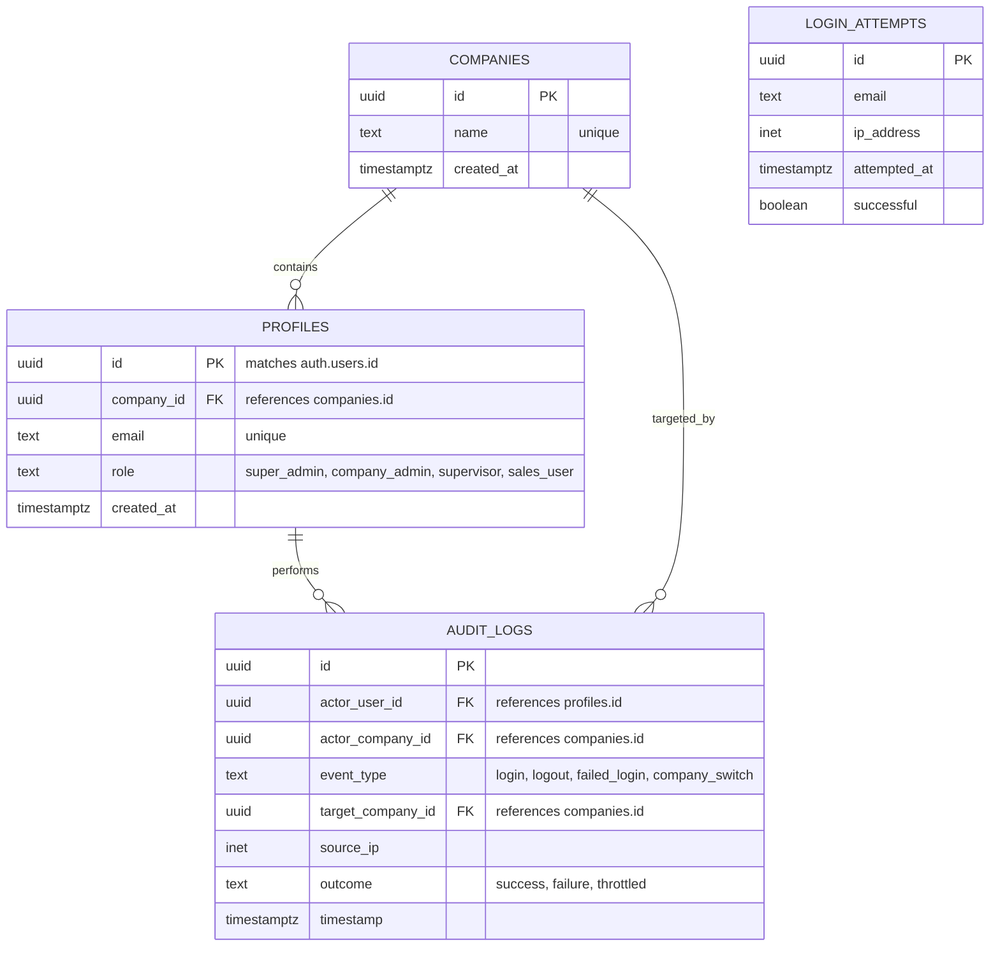

# Data Model: Foundational Access Layer (Authentication & Tenant Isolation)

This document describes the database schema, entity relationships, validation constraints, and Row Level Security (RLS) policies.

---

## 1. Database Schema

All tables belong to the `public` schema in PostgreSQL.



### 1.1 `public.companies`
Stores the isolated companies (tenants) operating on the platform.
* `id` (`uuid`, Primary Key, default: `gen_random_uuid()`)
* `name` (`text`, unique, not null)
* `created_at` (`timestamp with time zone`, default: `now()`)

### 1.2 `public.profiles`
Links Supabase Auth users (`auth.users`) to their company and roles.
* `id` (`uuid`, Primary Key, references `auth.users(id)` ON DELETE CASCADE)
* `company_id` (`uuid`, not null, references `public.companies(id)`)
* `email` (`text`, unique, not null)
* `role` (`text`, not null) - Check constraint: `role IN ('super_admin', 'company_admin', 'supervisor', 'sales_user')`
* `created_at` (`timestamp with time zone`, default: `now()`)

### 1.3 `public.login_attempts`
Tracks login attempts to enforce the 30-second brute-force cooldown.
* `id` (`uuid`, Primary Key, default: `gen_random_uuid()`)
* `email` (`text`, not null)
* `ip_address` (`inet`, not null)
* `attempted_at` (`timestamp with time zone`, default: `now()`)
* `successful` (`boolean`, not null)

### 1.4 `public.audit_logs`
Append-only log containing security audits.
* `id` (`uuid`, Primary Key, default: `gen_random_uuid()`)
* `actor_user_id` (`uuid`, references `public.profiles(id)` ON DELETE SET NULL)
* `actor_company_id` (`uuid`, references `public.companies(id)` ON DELETE SET NULL)
* `event_type` (`text`, not null) - Check constraint: `event_type IN ('login', 'logout', 'failed_login', 'company_switch')`
* `target_company_id` (`uuid`, references `public.companies(id)` ON DELETE SET NULL)
* `source_ip` (`inet`)
* `outcome` (`text`, not null) - Check constraint: `outcome IN ('success', 'failure', 'throttled')`
* `timestamp` (`timestamp with time zone`, default: `now()`)

---

## 2. Row Level Security (RLS) Policies

All operational tables have `ROW LEVEL SECURITY` enabled by default (deny all). Policies scope access by JWT custom claims (which contain `company_id` and `role`).

### 2.1 Helpers & JWT Claim Resolution
To resolve the user's active context without hitting the `profiles` join, we inspect the JWT:
- `auth.jwt() ->> 'role'` resolves to the user's role.
- `auth.jwt() ->> 'company_id'` resolves to the user's assigned company ID.
- For `super_admin`, we read the custom session parameter or the HTTP cookie `active_company_id`. We can write a PostgreSQL helper function:
  ```sql
  CREATE OR REPLACE FUNCTION get_active_company_id()
  RETURNS uuid AS $$
  BEGIN
    -- If super_admin, check if an override company is set in the session context config
    IF auth.jwt() ->> 'role' = 'super_admin' THEN
      RETURN NULLIF(current_setting('request.cookies.active_company_id', true), '')::uuid;
    END IF;
    -- For all other roles, return their profile company_id embedded in JWT
    RETURN (auth.jwt() ->> 'company_id')::uuid;
  END;
  $$ LANGUAGE plpgsql SECURITY DEFINER;
  ```

### 2.2 Table RLS Policies

#### Table: `public.companies`
- **SELECT**:
  - `auth.jwt() ->> 'role' = 'super_admin'` OR `id = get_active_company_id()`
- **ALL OTHER OPERATIONS**:
  - `auth.jwt() ->> 'role' = 'super_admin'` (Only Super Admins can manage companies).

#### Table: `public.profiles`
- **SELECT**:
  - `auth.jwt() ->> 'role' = 'super_admin'` (Can see all profiles)
  - `auth.jwt() ->> 'role' IN ('company_admin', 'supervisor') AND company_id = get_active_company_id()` (Can see own company profiles)
  - `id = auth.uid()` (Any user can see their own profile)
- **ALL OTHER OPERATIONS**:
  - Deny by default (only modifiable by admin backend or trigger).

#### Table: `public.login_attempts`
- RLS enabled. No client policies defined (Server-side service-role only).

#### Table: `public.audit_logs`
- **SELECT**:
  - `auth.jwt() ->> 'role' = 'super_admin'` (Can view all logs)
  - `auth.jwt() ->> 'role' = 'company_admin' AND actor_company_id = get_active_company_id()` (Can view own company logs)
- **INSERT**:
  - `auth.uid() IS NOT NULL` (Allows authenticated users to append logs during their session)
- **UPDATE / DELETE**:
  - Denied (Append-only table).
