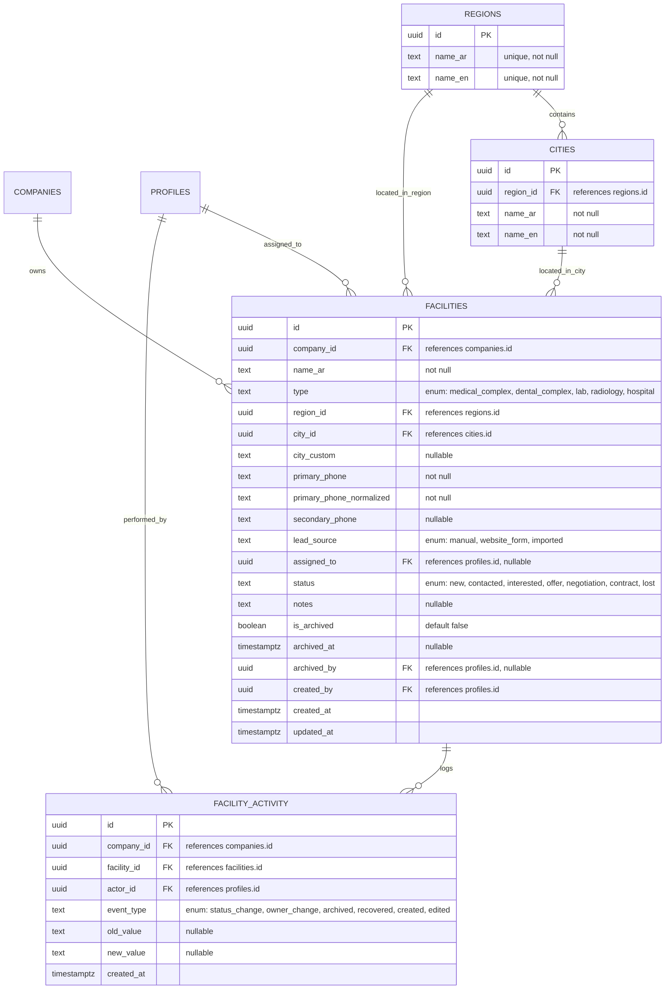

# Data Model: Facility Management

This document describes the database schema, entity relationships, validation constraints, and Row Level Security (RLS) policies for Facility Management.

---

## 1. Database Schema

All tables belong to the `public` schema in PostgreSQL.



### 1.1 Custom PostgreSQL Enum Types
To enforce field constraints, the following custom enum types are defined:
* `public.facility_type`: `'medical_complex'`, `'dental_complex'`, `'lab'`, `'radiology'`, `'hospital'`
* `public.lead_source`: `'manual'`, `'website_form'`, `'imported'`
* `public.facility_status`: `'new'`, `'contacted'`, `'interested'`, `'offer'`, `'negotiation'`, `'contract'`, `'lost'`
* `public.facility_activity_type`: `'status_change'`, `'owner_change'`, `'archived'`, `'recovered'`, `'created'`, `'edited'`

### 1.2 Table: `public.regions`
Stores Saudi Arabia's 13 administrative regions.
* `id` (`uuid`, Primary Key, default: `gen_random_uuid()`)
* `name_ar` (`text`, unique, not null)
* `name_en` (`text`, unique, not null)
* `created_at` (`timestamp with time zone`, default: `now()`)

### 1.3 Table: `public.cities`
Stores cities mapping to Saudi regions.
* `id` (`uuid`, Primary Key, default: `gen_random_uuid()`)
* `region_id` (`uuid`, not null, references `public.regions(id)`)
* `name_ar` (`text`, not null)
* `name_en` (`text`, not null)
* `created_at` (`timestamp with time zone`, default: `now()`)
* *Note: A special city seed record with `name_ar = 'أخرى'` / `name_en = 'Other'` exists in each region.*

### 1.4 Table: `public.facilities`
The central CRM record representing a medical organization lead.
* `id` (`uuid`, Primary Key, default: `gen_random_uuid()`)
* `company_id` (`uuid`, not null, references `public.companies(id)`)
* `name_ar` (`text`, not null)
* `type` (`public.facility_type`, not null)
* `region_id` (`uuid`, not null, references `public.regions(id)`)
* `city_id` (`uuid`, not null, references `public.cities(id)`)
* `city_custom` (`text`) - Captured when `city_id` references the "Other" city option.
* `primary_phone` (`text`, not null)
* `primary_phone_normalized` (`text`, not null)
* `secondary_phone` (`text`)
* `lead_source` (`public.lead_source`, not null, default: `'manual'`)
* `assigned_to` (`uuid`, references `public.profiles(id)`) - Must belong to same company and have `sales_user` or supervisor/admin role.
* `status` (`public.facility_status`, not null, default: `'new'`)
* `notes` (`text`)
* `is_active` (`boolean`, not null, default: `true`) - Toggled to `false` when archived.
* `archived_at` (`timestamp with time zone`)
* `archived_by` (`uuid`, references `public.profiles(id)`)
* `created_by` (`uuid`, not null, references `public.profiles(id)`)
* `created_at` (`timestamp with time zone`, default: `now()`)
* `updated_at` (`timestamp with time zone`, default: `now()`)

### 1.5 Table: `public.facility_activity`
Separate CRM history log, tracking lifecycle changes.
* `id` (`uuid`, Primary Key, default: `gen_random_uuid()`)
* `company_id` (`uuid`, not null, references `public.companies(id)`)
* `facility_id` (`uuid`, not null, references `public.facilities(id)` ON DELETE CASCADE)
* `actor_id` (`uuid`, not null, references `public.profiles(id)`)
* `event_type` (`public.facility_activity_type`, not null)
* `old_value` (`text`)
* `new_value` (`text`)
* `created_at` (`timestamp with time zone`, default: `now()`)

---

## 2. Database Indexes & Constraints

### 2.1 Indexes
* `idx_facilities_company_id` on `public.facilities(company_id)`
* `idx_facilities_assigned_to` on `public.facilities(assigned_to)`
* `idx_facilities_status` on `public.facilities(status)`
* `idx_facilities_region_city` on `public.facilities(region_id, city_id)`
* `idx_facility_activity_facility_id` on `public.facility_activity(facility_id)`
* `idx_facility_activity_company_id` on `public.facility_activity(company_id)`

### 2.2 Uniqueness Constraints
To enforce primary phone number uniqueness within a single tenant (company):
* **Partial Unique Index**:
  ```sql
  CREATE UNIQUE INDEX idx_facilities_phone_unique_per_company 
  ON public.facilities (company_id, primary_phone_normalized) 
  WHERE (is_active = true AND primary_phone_normalized IS NOT NULL);
  ```
  *Rationale: A company cannot have two active leads with the same normalized primary phone. Duplicates are allowed between different companies. Deactivated or archived facilities are ignored.*

### 2.3 Database Triggers
1. **Phone Normalization Trigger**:
   Automatically normalizes `primary_phone` on insert or update, and stores it in `primary_phone_normalized`.
2. **Updated At Trigger**:
   Standard trigger to update `updated_at` timestamps on the `facilities` table.

---

## 3. Row Level Security (RLS) Policies

All tables have RLS enabled. They retrieve the active `company_id` and the user's `role` via the custom JWT claims hook established in Feature 001.

### 3.1 Helpers
Uses the `get_active_company_id()` function:
```sql
CREATE OR REPLACE FUNCTION get_active_company_id()
RETURNS uuid AS $$
BEGIN
  IF auth.jwt() ->> 'role' = 'super_admin' THEN
    RETURN NULLIF(current_setting('request.cookies.active_company_id', true), '')::uuid;
  END IF;
  RETURN (auth.jwt() ->> 'company_id')::uuid;
END;
$$ LANGUAGE plpgsql SECURITY DEFINER;
```

### 3.2 Policies: `public.facilities`

#### **SELECT**
* **Sales User**: Can read if `company_id = get_active_company_id() AND assigned_to = auth.uid() AND is_active = true`.
* **Supervisor & Company Admin**: Can read if `company_id = get_active_company_id()`.
* **Super Admin**: Can read if `company_id = get_active_company_id()` (which resolves switch override).

#### **INSERT**
* **Sales User**: Can create if `company_id = (auth.jwt() ->> 'company_id')::uuid` AND `assigned_to = auth.uid()`.
* **Supervisor & Company Admin**: Can create if `company_id = (auth.jwt() ->> 'company_id')::uuid`.
* **Super Admin**: Can create if `company_id = get_active_company_id()`.

#### **UPDATE**
* **Sales User**: Can edit if `company_id = get_active_company_id() AND assigned_to = auth.uid() AND is_active = true`.
  * *Database Trigger / Constraint prevents updating `assigned_to` or changing `is_active` by Sales User (or validated server-side).*
* **Supervisor & Company Admin**: Can edit if `company_id = get_active_company_id()`.
* **Super Admin**: Can edit if `company_id = get_active_company_id()`.

#### **DELETE**
* Deny by default. Hard-deletes are disallowed.

### 3.3 Policies: `public.facility_activity`

#### **SELECT**
* Inherits visibility from facilities:
  ```sql
  CREATE POLICY select_facility_activity ON public.facility_activity
  FOR SELECT USING (
    EXISTS (
      SELECT 1 FROM public.facilities 
      WHERE facilities.id = facility_activity.facility_id
    )
  );
  ```

#### **INSERT**
* Only allowed for users who can edit the facility:
  ```sql
  CREATE POLICY insert_facility_activity ON public.facility_activity
  FOR INSERT WITH CHECK (
    EXISTS (
      SELECT 1 FROM public.facilities 
      WHERE facilities.id = facility_activity.facility_id 
      AND facilities.company_id = get_active_company_id()
    )
  );
  ```

#### **UPDATE / DELETE**
* Denied (history log is append-only).
