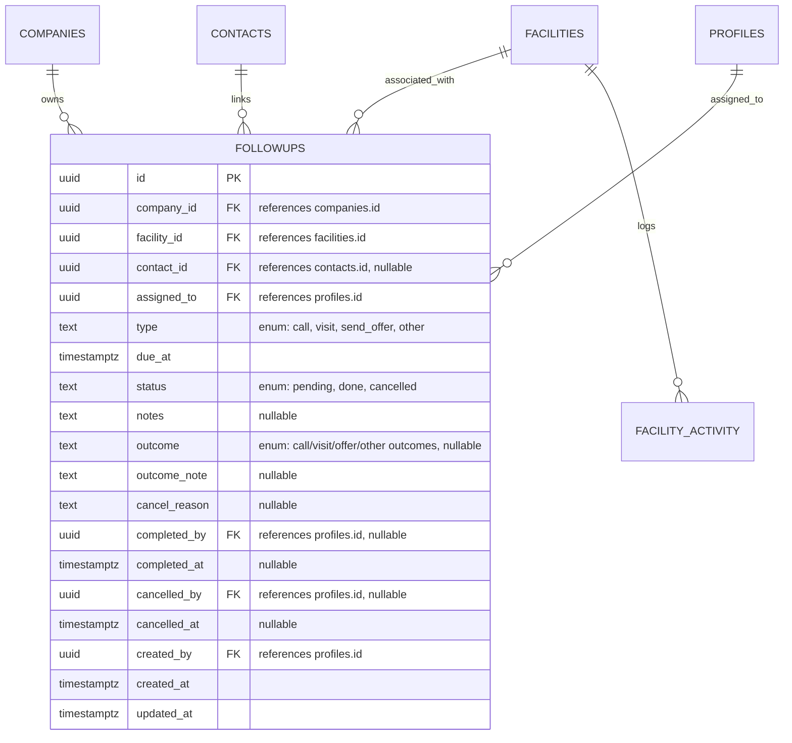

# Data Model: Follow-up Management

This document describes the database schema, entity relationships, validation constraints, and Row Level Security (RLS) policies for Follow-up Management.

---

## 1. Database Schema

All tables belong to the `public` schema in PostgreSQL.



### 1.1 Custom PostgreSQL Enum Types
* `public.followup_type`: `'call'`, `'visit'`, `'send_offer'`, `'other'`
* `public.followup_status`: `'pending'`, `'done'`, `'cancelled'`
* `public.followup_outcome`:
  * `'answered'`, `'no_answer'`, `'callback_requested'`, `'not_interested'` (Calls)
  * `'met_decision_maker'`, `'no_show'`, `'rescheduled'`, `'followup_needed'` (Visits)
  * `'offer_sent'`, `'feedback_received'`, `'offer_rejected'`, `'offer_accepted'` (Offers)
  * `'task_completed'`, `'postponed'` (Other)

### 1.2 Table: `public.followups`
Tracks scheduled follow-up tasks and outcomes.
* `id` (`uuid`, Primary Key, default: `gen_random_uuid()`)
* `company_id` (`uuid`, not null, references `public.companies(id)`) - Denormalized for RLS and query isolation.
* `facility_id` (`uuid`, not null, references `public.facilities(id)` ON DELETE CASCADE)
* `contact_id` (`uuid`, references `public.contacts(id)` ON DELETE SET NULL)
* `assigned_to` (`uuid`, not null, references `public.profiles(id)`) - Must belong to the same company.
* `type` (`public.followup_type`, not null)
* `due_at` (`timestamp with time zone`, not null)
* `status` (`public.followup_status`, not null, default: `'pending'`)
* `notes` (`text`)
* `outcome` (`public.followup_outcome`)
* `outcome_note` (`text`)
* `cancel_reason` (`text`)
* `completed_by` (`uuid`, references `public.profiles(id)`)
* `completed_at` (`timestamp with time zone`)
* `cancelled_by` (`uuid`, references `public.profiles(id)`)
* `cancelled_at` (`timestamp with time zone`)
* `created_by` (`uuid`, not null, references `public.profiles(id)`)
* `created_at` (`timestamp with time zone`, default: `now()`)
* `updated_at` (`timestamp with time zone`, default: `now()`)

---

## 2. Database Indexes & Constraints

### 2.1 Indexes
* `idx_followups_company_id` on `public.followups(company_id)`
* `idx_followups_facility_id` on `public.followups(facility_id)`
* `idx_followups_assigned_to` on `public.followups(assigned_to)`
* `idx_followups_status_due_at` on `public.followups(status, due_at)`
  * *Rationale: Highly optimized index for the consolidated "All Pending" list view, sorting active follow-ups by due date.*

### 2.2 Composite Uniqueness & Foreign Key Constraint (Contact Scope Validation)
To enforce that a follow-up's linked contact belongs to the exact same facility:
1. Create a unique constraint on `(facility_id, id)` in `public.contacts`:
   ```sql
   ALTER TABLE public.contacts 
   ADD CONSTRAINT uniq_contacts_facility_and_id UNIQUE (facility_id, id);
   ```
2. Create a composite foreign key on `(facility_id, contact_id)` in `public.followups`:
   ```sql
   ALTER TABLE public.followups
   ADD CONSTRAINT fk_followups_facility_contact
   FOREIGN KEY (facility_id, contact_id)
   REFERENCES public.contacts(facility_id, id)
   ON DELETE SET NULL;
   ```
   *Rationale: The database compiler enforces that a follow-up cannot reference a contact ID unless that contact is also linked to the same facility ID.*

---

## 3. Row Level Security (RLS) Policies

All tables have RLS enabled and query `get_active_company_id()` for isolation.

### 3.1 Policies: `public.followups`

#### **SELECT**
* **Sales User**: Can read if `company_id = get_active_company_id() AND EXISTS (SELECT 1 FROM public.facilities WHERE facilities.id = followups.facility_id AND facilities.assigned_to = auth.uid())`.
* **Supervisor & Company Admin**: Can read if `company_id = get_active_company_id()`.
* **Super Admin**: Can read if `company_id = get_active_company_id()`.

#### **INSERT**
* **Sales User**: Can create if:
  * `company_id = (auth.jwt() ->> 'company_id')::uuid`
  * `assigned_to = auth.uid()` (Sales User can only assign follow-ups to themselves)
  * `EXISTS (SELECT 1 FROM public.facilities WHERE facilities.id = followups.facility_id AND facilities.assigned_to = auth.uid() AND facilities.is_active = true)`
* **Supervisor & Company Admin**: Can create if:
  * `company_id = (auth.jwt() ->> 'company_id')::uuid`
  * `EXISTS (SELECT 1 FROM public.facilities WHERE facilities.id = followups.facility_id AND facilities.is_active = true)`
* **Super Admin**: Can create if:
  * `company_id = get_active_company_id()`
  * `EXISTS (SELECT 1 FROM public.facilities WHERE facilities.id = followups.facility_id AND facilities.is_active = true)`

#### **UPDATE**
* **Sales User**: Can edit if:
  * `company_id = get_active_company_id()`
  * `EXISTS (SELECT 1 FROM public.facilities WHERE facilities.id = followups.facility_id AND facilities.assigned_to = auth.uid() AND facilities.is_active = true)`
  * `assigned_to = (SELECT assigned_to FROM public.followups WHERE id = followups.id)` (Locked: cannot change the owner)
* **Supervisor & Company Admin**: Can edit if `company_id = get_active_company_id()`.
* **Super Admin**: Can edit if `company_id = get_active_company_id()`.

#### **DELETE**
* Deny all (Hard deletes forbidden).
