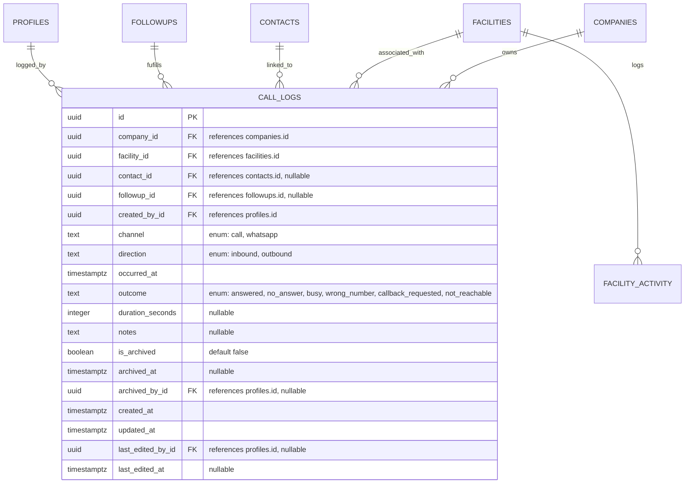

# Data Model: Call and Communication Logging

This document describes the database schema, entity relationships, validation constraints, and Row Level Security (RLS) policies for Call and Communication Logging.

---

## 1. Database Schema

All tables belong to the `public` schema in PostgreSQL.



### 1.1 Custom PostgreSQL Enum Types
* `public.communication_channel`: `'call'`, `'whatsapp'`
* `public.communication_direction`: `'inbound'`, `'outbound'`
* `public.communication_outcome`: `'answered'`, `'no_answer'`, `'busy'`, `'wrong_number'`, `'callback_requested'`, `'not_reachable'`

### 1.2 Table: `public.call_logs`
Tracks actual manual communication records with facilities or specific facility contacts.
* `id` (`uuid`, Primary Key, default: `gen_random_uuid()`)
* `company_id` (`uuid`, not null, references `public.companies(id)`) - Denormalized for RLS.
* `facility_id` (`uuid`, not null, references `public.facilities(id)` ON DELETE CASCADE)
* `contact_id` (`uuid`, references `public.contacts(id)` ON DELETE SET NULL)
* `followup_id` (`uuid`, references `public.followups(id)` ON DELETE SET NULL)
* `created_by_id` (`uuid`, not null, references `public.profiles(id)`)
* `channel` (`public.communication_channel`, not null)
* `direction` (`public.communication_direction`, not null)
* `occurred_at` (`timestamp with time zone`, not null, default: `now()`)
* `outcome` (`public.communication_outcome`, not null)
* `duration_seconds` (`integer`, nullable) - Duration of the interaction.
* `notes` (`text`, nullable)
* `is_archived` (`boolean`, not null, default: `false`)
* `archived_at` (`timestamp with time zone`, nullable)
* `archived_by_id` (`uuid`, references `public.profiles(id)`)
* `created_at` (`timestamp with time zone`, default: `now()`)
* `updated_at` (`timestamp with time zone`, default: `now()`)
* `last_edited_by_id` (`uuid`, references `public.profiles(id)`)
* `last_edited_at` (`timestamp with time zone`)

---

## 2. Database Indexes & Constraints

### 2.1 Indexes
* `idx_call_logs_company_id` on `public.call_logs(company_id)`
* `idx_call_logs_facility_id` on `public.call_logs(facility_id)`
* `idx_call_logs_occurred_at` on `public.call_logs(occurred_at DESC)`
  * *Rationale: Optimized for loading chronological activity streams for a facility (newest first).*

### 2.2 Validation Triggers and Constraints

#### 2.2.1 Scope & Owner Validation Trigger
To enforce that:
1. Linked contacts belong to the same facility.
2. Linked follow-ups belong to the same facility and company.
3. The `occurred_at` timestamp is not in the future.
We create a database trigger:
```sql
CREATE OR REPLACE FUNCTION validate_call_log_insertion_or_update()
RETURNS TRIGGER AS $$
BEGIN
  -- Prevent future timestamps
  IF NEW.occurred_at > NOW() + INTERVAL '1 minute' THEN
    RAISE EXCEPTION 'The communication date/time cannot be in the future.'
      USING ERRCODE = 'check_violation';
  END IF;

  -- Verify contact belongs to the same facility
  IF NEW.contact_id IS NOT NULL THEN
    IF NOT EXISTS (
      SELECT 1 FROM public.contacts 
      WHERE id = NEW.contact_id AND facility_id = NEW.facility_id
    ) THEN
      RAISE EXCEPTION 'The selected contact must belong to the associated facility.'
        USING ERRCODE = 'foreign_key_violation';
    END IF;
  END IF;

  -- Verify follow-up belongs to the same facility and company
  IF NEW.followup_id IS NOT NULL THEN
    IF NOT EXISTS (
      SELECT 1 FROM public.followups 
      WHERE id = NEW.followup_id 
        AND facility_id = NEW.facility_id 
        AND company_id = NEW.company_id
    ) THEN
      RAISE EXCEPTION 'The selected follow-up must belong to the associated facility and company.'
        USING ERRCODE = 'foreign_key_violation';
    END IF;
  END IF;

  RETURN NEW;
END;
$$ LANGUAGE plpgsql SECURITY DEFINER;

CREATE TRIGGER trg_validate_call_log
BEFORE INSERT OR UPDATE ON public.call_logs
FOR EACH ROW EXECUTE FUNCTION validate_call_log_insertion_or_update();
```

---

## 3. Row Level Security (RLS) Policies

All tables have RLS enabled and query the current user's claims for isolation.

### 3.1 Policies: `public.call_logs`

#### **SELECT**
* **Sales User**: Can read if:
  * `company_id = (auth.jwt() ->> 'company_id')::uuid`
  * `EXISTS (SELECT 1 FROM public.facilities WHERE facilities.id = call_logs.facility_id AND facilities.assigned_to = auth.uid())`
* **Supervisor & Company Admin**: Can read if `company_id = (auth.jwt() ->> 'company_id')::uuid`.
* **Super Admin**: Can read if `company_id = get_active_company_id()`.

#### **INSERT**
* **Sales User**: Can create if:
  * `company_id = (auth.jwt() ->> 'company_id')::uuid`
  * `created_by_id = auth.uid()`
  * `EXISTS (SELECT 1 FROM public.facilities WHERE facilities.id = call_logs.facility_id AND facilities.assigned_to = auth.uid() AND facilities.is_active = true)`
* **Supervisor & Company Admin**: Can create if:
  * `company_id = (auth.jwt() ->> 'company_id')::uuid`
  * `EXISTS (SELECT 1 FROM public.facilities WHERE facilities.id = call_logs.facility_id AND facilities.is_active = true)`
* **Super Admin**: Can create if:
  * `company_id = get_active_company_id()`
  * `EXISTS (SELECT 1 FROM public.facilities WHERE facilities.id = call_logs.facility_id AND facilities.is_active = true)`

#### **UPDATE**
Updates are checked server-side via the 24-hour trigger (`check_call_log_edit_window`) in addition to RLS:
* **Sales User**: Can edit if:
  * `company_id = (auth.jwt() ->> 'company_id')::uuid`
  * `created_by_id = auth.uid()` (Only creator can edit)
  * `EXISTS (SELECT 1 FROM public.facilities WHERE facilities.id = call_logs.facility_id AND facilities.assigned_to = auth.uid() AND facilities.is_active = true)`
* **Supervisor & Company Admin**: Can edit if `company_id = (auth.jwt() ->> 'company_id')::uuid`.
* **Super Admin**: Can edit if `company_id = get_active_company_id()`.

#### **DELETE**
* Deny all (Soft-archiving only via update of `is_archived`).
