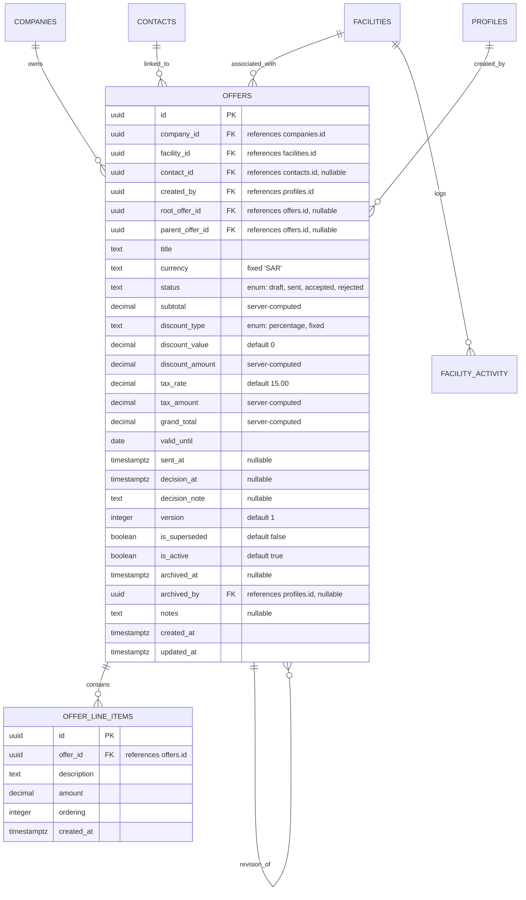

# Data Model: Offer (Quote) Management

This document describes the database schema, entity relationships, validation constraints, and Row Level Security (RLS) policies for Offer (Quote) Management.

---

## 1. Database Schema

All tables belong to the `public` schema in PostgreSQL.



### 1.1 Custom PostgreSQL Enum Types
* `public.offer_status`: `'draft'`, `'sent'`, `'accepted'`, `'rejected'`
* `public.discount_type`: `'percentage'`, `'fixed'`

### 1.2 Table: `public.offers`
Tracks commercial proposals and versions associated with a facility.
* `id` (`uuid`, Primary Key, default: `gen_random_uuid()`)
* `company_id` (`uuid`, not null, references `public.companies(id)`) - Denormalized for RLS.
* `facility_id` (`uuid`, not null, references `public.facilities(id)` ON DELETE CASCADE)
* `contact_id` (`uuid`, references `public.contacts(id)` ON DELETE SET NULL)
* `created_by` (`uuid`, not null, references `public.profiles(id)`)
* `root_offer_id` (`uuid`, references `public.offers(id)` ON DELETE SET NULL) - Points to the original offer version in the chain. Nullable (if it's the root).
* `parent_offer_id` (`uuid`, references `public.offers(id)` ON DELETE SET NULL) - Points to the immediate predecessor offer.
* `title` (`text`, not null)
* `currency` (`text`, not null, default: `'SAR'`)
* `status` (`public.offer_status`, not null, default: `'draft'`)
* `subtotal` (`numeric(15,2)`, not null, default: `0.00`)
* `discount_type` (`public.discount_type`, not null, default: `'fixed'`)
* `discount_value` (`numeric(15,2)`, not null, default: `0.00`)
* `discount_amount` (`numeric(15,2)`, not null, default: `0.00`)
* `tax_rate` (`numeric(5,2)`, not null, default: `15.00`)
* `tax_amount` (`numeric(15,2)`, not null, default: `0.00`)
* `grand_total` (`numeric(15,2)`, not null, default: `0.00`)
* `valid_until` (`date`, not null)
* `sent_at` (`timestamp with time zone`, nullable)
* `decision_at` (`timestamp with time zone`, nullable)
* `decision_note` (`text`, nullable)
* `version` (`integer`, not null, default: `1`)
* `is_superseded` (`boolean`, not null, default: `false`)
* `is_active` (`boolean`, not null, default: `true`)
* `archived_at` (`timestamp with time zone`, nullable)
* `archived_by` (`uuid`, references `public.profiles(id)`, nullable)
* `notes` (`text`, nullable)
* `created_at` (`timestamp with time zone`, default: `now()`)
* `updated_at` (`timestamp with time zone`, default: `now()`)

### 1.3 Table: `public.offer_line_items`
Tracks individual line items within an offer.
* `id` (`uuid`, Primary Key, default: `gen_random_uuid()`)
* `offer_id` (`uuid`, not null, references `public.offers(id)` ON DELETE CASCADE)
* `description` (`text`, not null)
* `amount` (`numeric(15,2)`, not null)
* `ordering` (`integer`, not null, default: `0`)
* `created_at` (`timestamp with time zone`, default: `now()`)

---

## 2. Database Indexes & Constraints

### 2.1 Indexes
* `idx_offers_company_id` on `public.offers(company_id)`
* `idx_offers_facility_id` on `public.offers(facility_id)`
* `idx_offers_root_offer_id` on `public.offers(root_offer_id)`
* `idx_offers_status` on `public.offers(status)`
* `idx_offers_valid_until` on `public.offers(valid_until)`
* `idx_offer_line_items_offer_id` on `public.offer_line_items(offer_id)`

### 2.2 Constraints
* **Version Integrity Guard**:
  ```sql
  ALTER TABLE public.offers ADD CONSTRAINT offers_root_version_uq UNIQUE (company_id, root_offer_id, version);
  ```

---

## 3. Database Triggers & Calculations

### 3.1 Subtotal Synchronization
Updates the parent offer's `subtotal` when a line item is inserted, updated, or deleted.
```sql
CREATE OR REPLACE FUNCTION update_offer_subtotal_on_line_item_change()
RETURNS TRIGGER AS $$
DECLARE
  v_offer_id uuid;
BEGIN
  IF TG_OP = 'DELETE' THEN
    v_offer_id := OLD.offer_id;
  ELSE
    v_offer_id := NEW.offer_id;
  END IF;

  UPDATE public.offers
  SET subtotal = COALESCE((SELECT SUM(amount) FROM public.offer_line_items WHERE offer_id = v_offer_id), 0)
  WHERE id = v_offer_id;

  RETURN NULL;
END;
$$ LANGUAGE plpgsql;

CREATE TRIGGER trg_update_offer_subtotal
AFTER INSERT OR UPDATE OR DELETE ON public.offer_line_items
FOR EACH ROW EXECUTE FUNCTION update_offer_subtotal_on_line_item_change();
```

### 3.2 Totals Calculation
Calculates the discount amount, tax amount, and grand total server-side, verifying that discount does not exceed the subtotal.
```sql
CREATE OR REPLACE FUNCTION calculate_offer_totals()
RETURNS TRIGGER AS $$
BEGIN
  -- 1. Calculate discount_amount
  IF NEW.discount_type = 'percentage' THEN
    NEW.discount_amount := ROUND((NEW.subtotal * (NEW.discount_value / 100.0)), 2);
  ELSE
    NEW.discount_amount := ROUND(NEW.discount_value, 2);
  END IF;

  -- 2. Check discount does not exceed subtotal
  IF NEW.discount_amount > NEW.subtotal THEN
    RAISE EXCEPTION 'Discount amount cannot exceed the offer subtotal.'
      USING ERRCODE = 'check_violation';
  END IF;

  -- 3. Compute tax and grand total
  NEW.tax_amount := ROUND(((NEW.subtotal - NEW.discount_amount) * (NEW.tax_rate / 100.0)), 2);
  NEW.grand_total := (NEW.subtotal - NEW.discount_amount) + NEW.tax_amount;

  RETURN NEW;
END;
$$ LANGUAGE plpgsql;

CREATE TRIGGER trg_calculate_offer_totals
BEFORE INSERT OR UPDATE ON public.offers
FOR EACH ROW EXECUTE FUNCTION calculate_offer_totals();
```

### 3.3 Immutability and Contact Validation
Checks that linked contacts belong to the parent facility, and blocks modifications to pricing of sent/decided offers.
```sql
CREATE OR REPLACE FUNCTION validate_offer_and_immutability()
RETURNS TRIGGER AS $$
BEGIN
  -- Verify contact belongs to the same facility
  IF NEW.contact_id IS NOT NULL THEN
    IF NOT EXISTS (
      SELECT 1 FROM public.contacts 
      WHERE id = NEW.contact_id AND facility_id = NEW.facility_id
    ) THEN
      RAISE EXCEPTION 'The selected contact must belong to the associated facility.'
        USING ERRCODE = 'foreign_key_violation';
    END IF;
  END IF;

  -- Immutability on Sent/Accepted/Rejected status
  IF TG_OP = 'UPDATE' THEN
    IF OLD.status IN ('sent', 'accepted', 'rejected') THEN
      -- Allow changes only to status, decision metadata, is_superseded, and archival flags
      IF OLD.title IS DISTINCT FROM NEW.title OR
         OLD.subtotal IS DISTINCT FROM NEW.subtotal OR
         OLD.discount_type IS DISTINCT FROM NEW.discount_type OR
         OLD.discount_value IS DISTINCT FROM NEW.discount_value OR
         OLD.tax_rate IS DISTINCT FROM NEW.tax_rate OR
         OLD.parent_offer_id IS DISTINCT FROM NEW.parent_offer_id OR
         OLD.root_offer_id IS DISTINCT FROM NEW.root_offer_id OR
         OLD.version IS DISTINCT FROM NEW.version OR
         OLD.notes IS DISTINCT FROM NEW.notes THEN
        RAISE EXCEPTION 'Cannot modify priced or core content of an offer that has already been sent.'
          USING ERRCODE = 'check_violation';
      END IF;
    END IF;
  END IF;

  RETURN NEW;
END;
$$ LANGUAGE plpgsql;

CREATE TRIGGER trg_validate_offer_and_immutability
BEFORE INSERT OR UPDATE ON public.offers
FOR EACH ROW EXECUTE FUNCTION validate_offer_and_immutability();
```

---

## 4. Row Level Security (RLS) Policies

RLS is enabled on both `public.offers` and `public.offer_line_items` to enforce multi-tenant isolation and role-based visibility.

### 4.1 Policies: `public.offers`

#### **SELECT**
* **Sales User**: Can read if:
  * `company_id = (auth.jwt() ->> 'company_id')::uuid`
  * `EXISTS (SELECT 1 FROM public.facilities f WHERE f.id = offers.facility_id AND f.assigned_to = auth.uid())`
* **Supervisor & Company Admin**: Can read if `company_id = (auth.jwt() ->> 'company_id')::uuid`.
* **Super Admin**: Can read if `company_id = get_active_company_id()`.

#### **INSERT**
* **Sales User**: Can create if:
  * `company_id = (auth.jwt() ->> 'company_id')::uuid`
  * `created_by = auth.uid()`
  * `EXISTS (SELECT 1 FROM public.facilities f WHERE f.id = offers.facility_id AND f.assigned_to = auth.uid() AND f.is_active = true)`
* **Supervisor & Company Admin**: Can create if:
  * `company_id = (auth.jwt() ->> 'company_id')::uuid`
  * `EXISTS (SELECT 1 FROM public.facilities f WHERE f.id = offers.facility_id AND f.is_active = true)`
* **Super Admin**: Can create if:
  * `company_id = get_active_company_id()`
  * `EXISTS (SELECT 1 FROM public.facilities f WHERE f.id = offers.facility_id AND f.is_active = true)`

#### **UPDATE**
* **Sales User**: Can edit if:
  * `company_id = (auth.jwt() ->> 'company_id')::uuid`
  * `created_by = auth.uid()`
  * `EXISTS (SELECT 1 FROM public.facilities f WHERE f.id = offers.facility_id AND f.assigned_to = auth.uid() AND f.is_active = true)`
* **Supervisor & Company Admin**: Can edit if `company_id = (auth.jwt() ->> 'company_id')::uuid`.
* **Super Admin**: Can edit if `company_id = get_active_company_id()`.

#### **DELETE**
* Deny all. Soft-archival only via update of `is_active`.

### 4.2 Policies: `public.offer_line_items`

* Inherit all RLS rules of the parent offer through an `EXISTS` join on the `offers` table.
* **SELECT / INSERT / UPDATE**: Allowed if the user has corresponding permissions on the associated `offer_id` in the `offers` table.
* **DELETE**: Allowed only if the parent offer's status is `'draft'` and the user has edit rights on the parent offer.
