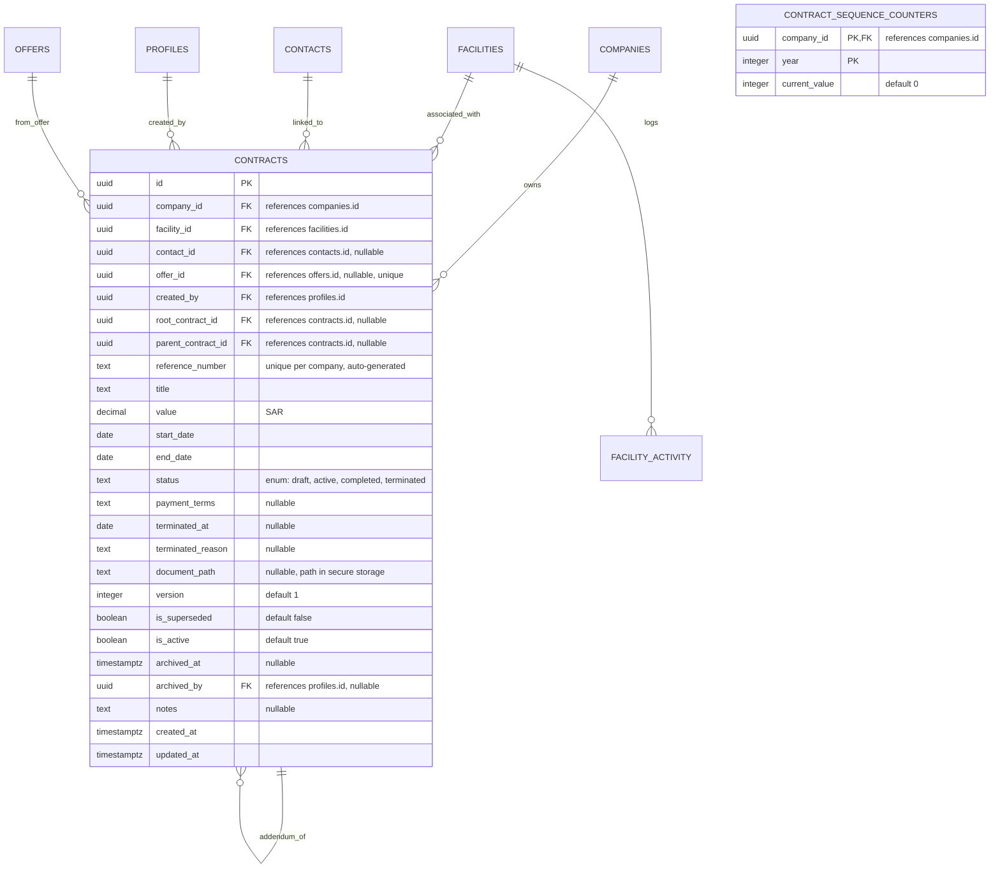

# Data Model: Contract Management

This document describes the database schema, entity relationships, validation constraints, Row Level Security (RLS) policies, and private storage structures for Contract Management.

---

## 1. Database Schema

All tables belong to the `public` schema in PostgreSQL.



### 1.1 Custom PostgreSQL Enum Types
* `public.contract_status`: `'draft'`, `'active'`, `'completed'`, `'terminated'`

### 1.2 Table: `public.contracts`
Tracks official signed engagements with medical facilities.
* `id` (`uuid`, Primary Key, default: `gen_random_uuid()`)
* `company_id` (`uuid`, not null, references `public.companies(id)`) - Denormalized for RLS.
* `facility_id` (`uuid`, not null, references `public.facilities(id)` ON DELETE CASCADE)
* `contact_id` (`uuid`, references `public.contacts(id)` ON DELETE SET NULL)
* `offer_id` (`uuid`, references `public.offers(id)` ON DELETE SET NULL) - Unique constraint.
* `created_by` (`uuid`, not null, references `public.profiles(id)`)
* `root_contract_id` (`uuid`, references `public.contracts(id)` ON DELETE SET NULL) - Points to the root contract.
* `parent_contract_id` (`uuid`, references `public.contracts(id)` ON DELETE SET NULL) - Points to the direct parent contract.
* `reference_number` (`text`, not null) - CON-YYYY-XXXX format.
* `title` (`text`, not null)
* `value` (`numeric(15,2)`, not null)
* `start_date` (`date`, not null)
* `end_date` (`date`, not null)
* `status` (`public.contract_status`, not null, default: `'draft'`)
* `payment_terms` (`text`, nullable)
* `terminated_at` (`date`, nullable)
* `terminated_reason` (`text`, nullable)
* `document_path` (`text`, nullable) - Path of object in `contracts` Supabase Storage bucket.
* `version` (`integer`, not null, default: `1`)
* `is_superseded` (`boolean`, not null, default: `false`)
* `is_active` (`boolean`, not null, default: `true`)
* `archived_at` (`timestamp with time zone`, nullable)
* `archived_by` (`uuid`, references `public.profiles(id)`, nullable)
* `notes` (`text`, nullable)
* `created_at` (`timestamp with time zone`, default: `now()`)
* `updated_at` (`timestamp with time zone`, default: `now()`)

### 1.3 Table: `public.contract_sequence_counters`
Tracks sequential numbers for generating reference IDs.
* `company_id` (`uuid`, Primary Key, references `public.companies(id)`)
* `year` (`integer`, Primary Key)
* `current_value` (`integer`, not null, default: `0`)

---

## 2. Database Indexes & Constraints

### 2.1 Indexes
* `idx_contracts_company_id` on `public.contracts(company_id)`
* `idx_contracts_facility_id` on `public.contracts(facility_id)`
* `idx_contracts_source_offer_id` on `public.contracts(offer_id)`
* `idx_contracts_status` on `public.contracts(status)`
* `idx_contracts_end_date` on `public.contracts(end_date)`
* `idx_contracts_root_contract_id` on `public.contracts(root_contract_id)`

### 2.2 Constraints
* **One-Contract-Per-Offer Constraint**:
  ```sql
  ALTER TABLE public.contracts ADD CONSTRAINT contracts_offer_id_uq UNIQUE (offer_id);
  ```
* **Company Reference Uniqueness**:
  ```sql
  ALTER TABLE public.contracts ADD CONSTRAINT contracts_reference_number_uq UNIQUE (company_id, reference_number);
  ```
* **Addendum Version Chain Uniqueness**:
  ```sql
  ALTER TABLE public.contracts ADD CONSTRAINT contracts_root_version_uq UNIQUE (company_id, root_contract_id, version);
  ```

---

## 3. Database Triggers & Calculations

### 3.1 Concurrency-Safe Reference ID Generator
Generates sequential IDs scoped by tenant and calendar year.
```sql
CREATE OR REPLACE FUNCTION generate_contract_reference_number()
RETURNS TRIGGER AS $$
DECLARE
  v_year integer;
  v_seq integer;
BEGIN
  -- Extract current year in Riyadh time
  v_year := EXTRACT(YEAR FROM NOW() AT TIME ZONE 'Asia/Riyadh');

  -- Lock and increment sequence counter row
  INSERT INTO public.contract_sequence_counters (company_id, year, current_value)
  VALUES (NEW.company_id, v_year, 1)
  ON CONFLICT (company_id, year)
  DO UPDATE SET current_value = public.contract_sequence_counters.current_value + 1
  RETURNING current_value INTO v_seq;

  -- Form the reference number CON-YYYY-XXXX (e.g. CON-2026-0001)
  NEW.reference_number := 'CON-' || v_year || '-' || LPAD(v_seq::text, 4, '0');

  RETURN NEW;
END;
$$ LANGUAGE plpgsql SECURITY DEFINER;

CREATE TRIGGER trg_generate_contract_reference_number
BEFORE INSERT ON public.contracts
FOR EACH ROW
WHEN (NEW.reference_number IS NULL OR NEW.reference_number = '')
EXECUTE FUNCTION generate_contract_reference_number();
```

### 3.2 Immutability and Date Validation
```sql
CREATE OR REPLACE FUNCTION validate_contract_rules_and_immutability()
RETURNS TRIGGER AS $$
BEGIN
  -- Chronology Validation
  IF NEW.start_date >= NEW.end_date THEN
    RAISE EXCEPTION 'Start date must be before the end date.'
      USING ERRCODE = 'check_violation';
  END IF;

  IF NEW.terminated_at IS NOT NULL AND NEW.terminated_at < NEW.start_date THEN
    RAISE EXCEPTION 'Termination date cannot be before the start date.'
      USING ERRCODE = 'check_violation';
  END IF;

  -- Verify contact belongs to same facility
  IF NEW.contact_id IS NOT NULL THEN
    IF NOT EXISTS (
      SELECT 1 FROM public.contacts 
      WHERE id = NEW.contact_id AND facility_id = NEW.facility_id
    ) THEN
      RAISE EXCEPTION 'The selected contact must belong to the associated facility.'
        USING ERRCODE = 'foreign_key_violation';
    END IF;
  END IF;

  -- Verify offer belongs to same facility and is in accepted status
  IF NEW.offer_id IS NOT NULL THEN
    IF NOT EXISTS (
      SELECT 1 FROM public.offers 
      WHERE id = NEW.offer_id 
        AND facility_id = NEW.facility_id 
        AND status = 'accepted'
    ) THEN
      RAISE EXCEPTION 'The linked offer must be accepted and belong to the same facility.'
        USING ERRCODE = 'foreign_key_violation';
    END IF;
  END IF;

  -- Immutability on Active/Completed/Terminated status
  IF TG_OP = 'UPDATE' THEN
    IF OLD.status IN ('active', 'completed', 'terminated') THEN
      -- Allow changes only to status, termination metadata, document_path, is_superseded, and archival flags
      IF OLD.title IS DISTINCT FROM NEW.title OR
         OLD.value IS DISTINCT FROM NEW.value OR
         OLD.start_date IS DISTINCT FROM NEW.start_date OR
         OLD.end_date IS DISTINCT FROM NEW.end_date OR
         OLD.offer_id IS DISTINCT FROM NEW.offer_id OR
         OLD.contact_id IS DISTINCT FROM NEW.contact_id OR
         OLD.facility_id IS DISTINCT FROM NEW.facility_id OR
         OLD.parent_contract_id IS DISTINCT FROM NEW.parent_contract_id OR
         OLD.root_contract_id IS DISTINCT FROM NEW.root_contract_id OR
         OLD.version IS DISTINCT FROM NEW.version OR
         OLD.notes IS DISTINCT FROM NEW.notes THEN
        RAISE EXCEPTION 'Cannot modify core or financial details of an active contract.'
          USING ERRCODE = 'check_violation';
      END IF;
    END IF;
  END IF;

  RETURN NEW;
END;
$$ LANGUAGE plpgsql;

CREATE TRIGGER trg_validate_contract_rules_and_immutability
BEFORE INSERT OR UPDATE ON public.contracts
FOR EACH ROW EXECUTE FUNCTION validate_contract_rules_and_immutability();
```

---

## 4. Row Level Security (RLS) Policies

RLS is enabled on `public.contracts` to enforce company isolation and role visibility.

### 4.1 Policies: `public.contracts`

#### **SELECT**
* **Sales User**: Can read if:
  * `company_id = (auth.jwt() ->> 'company_id')::uuid`
  * `EXISTS (SELECT 1 FROM public.facilities f WHERE f.id = contracts.facility_id AND f.assigned_to = auth.uid())`
* **Supervisor & Company Admin**: Can read if `company_id = (auth.jwt() ->> 'company_id')::uuid`.
* **Super Admin**: Can read if `company_id = get_active_company_id()`.

#### **INSERT** (Draft creation)
* **Sales User**: Can create drafts if:
  * `company_id = (auth.jwt() ->> 'company_id')::uuid`
  * `status = 'draft'`
  * `EXISTS (SELECT 1 FROM public.facilities f WHERE f.id = contracts.facility_id AND f.assigned_to = auth.uid() AND f.is_active = true)`
* **Supervisor & Company Admin**: Can create drafts if:
  * `company_id = (auth.jwt() ->> 'company_id')::uuid`
  * `EXISTS (SELECT 1 FROM public.facilities f WHERE f.id = contracts.facility_id AND f.is_active = true)`
* **Super Admin**: Can create drafts if:
  * `company_id = get_active_company_id()`
  * `EXISTS (SELECT 1 FROM public.facilities f WHERE f.id = contracts.facility_id AND f.is_active = true)`

#### **UPDATE**
* **Sales User**: Can edit draft if:
  * `company_id = (auth.jwt() ->> 'company_id')::uuid`
  * `status = 'draft'` -- Sales users cannot transition out of draft or edit active contracts
  * `created_by = auth.uid()`
  * `EXISTS (SELECT 1 FROM public.facilities f WHERE f.id = contracts.facility_id AND f.assigned_to = auth.uid() AND f.is_active = true)`
* **Supervisor & Company Admin**: Can edit and transition statuses if `company_id = (auth.jwt() ->> 'company_id')::uuid`.
* **Super Admin**: Can edit and transition statuses if `company_id = get_active_company_id()`.

#### **DELETE**
* Deny all. Soft-archival only via update of `is_active`.

---

## 5. Secure Storage Bucket Policies

Bucket `contracts` is created as a **private (non-public)** storage container.

### 5.1 Storage RLS Policies: `storage.objects`

#### **SELECT** (Read signed URLs/files)
Allows access if the user belongs to the target company and possesses visibility access to the contract:
```sql
CREATE POLICY "Allow scoped users to read contracts files" ON storage.objects
FOR SELECT TO authenticated
USING (
  bucket_id = 'contracts'
  AND (name LIKE 'company_' || (auth.jwt() ->> 'company_id') || '/%')
  AND EXISTS (
    SELECT 1 FROM public.contracts c
    WHERE c.company_id = (auth.jwt() ->> 'company_id')::uuid
      -- Extracts contract_id UUID from company_id/contracts/contract_id/file path
      AND c.id = (regexp_match(name, 'contracts/([^/]+)/'))[1]::uuid
      AND (
        -- If manager, allow read
        (auth.jwt() ->> 'role') IN ('supervisor', 'company_admin', 'super_admin')
        OR
        -- If rep, must own facility
        EXISTS (
          SELECT 1 FROM public.facilities f 
          WHERE f.id = c.facility_id AND f.assigned_to = auth.uid()
        )
      )
  )
);
```

#### **INSERT / UPDATE** (Write files)
Allows uploads if the folder company ID matches and user has edit rights on the contract:
```sql
CREATE POLICY "Allow authorized users to upload contracts files" ON storage.objects
FOR INSERT TO authenticated
WITH CHECK (
  bucket_id = 'contracts'
  AND (name LIKE 'company_' || (auth.jwt() ->> 'company_id') || '/%')
  AND EXISTS (
    SELECT 1 FROM public.contracts c
    WHERE c.company_id = (auth.jwt() ->> 'company_id')::uuid
      AND c.id = (regexp_match(name, 'contracts/([^/]+)/'))[1]::uuid
      AND c.status = 'draft' -- File uploads only allowed in draft state
      AND (
        (auth.jwt() ->> 'role') IN ('supervisor', 'company_admin', 'super_admin')
        OR
        (c.created_by = auth.uid() AND EXISTS (
          SELECT 1 FROM public.facilities f 
          WHERE f.id = c.facility_id AND f.assigned_to = auth.uid()
        ))
      )
  )
);
```

#### **DELETE** (Delete files)
Deny all (archiving contract preserves the storage file; no orphaned deletions).
