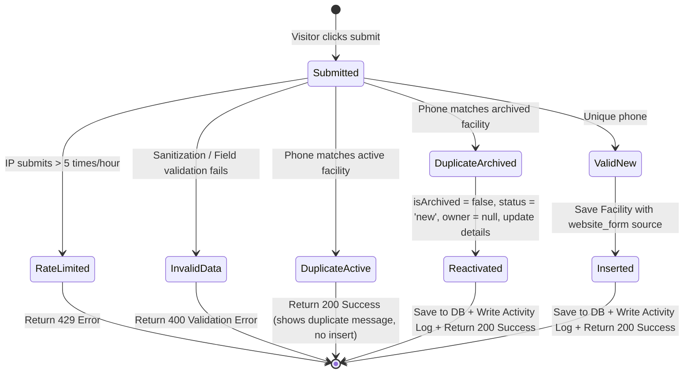

# Data Model Design: Public Lead Capture Form

This document outlines the data model extensions and updates required to support lead submissions from the public website.

## Entities & Fields

### 1. Facility (Existing Table Extension)
No new tables are introduced. The existing `Facility` schema is utilized, but we define constraints and values specific to the public lead-capture path.

| Field | Type | CRM Source | Public Submission Mapping | Validation Rules |
| :--- | :--- | :--- | :--- | :--- |
| `id` | `string` (UUID) | System generated | Generated server-side on insert | Unique prefix `fac-` + UUID |
| `companyId` | `string` | Tenant selector | Resolved from `DEFAULT_LEAD_COMPANY_ID` | Must match an active `Company` record |
| `name` | `string` | "اسم المنشأة" | Submitted `facilityName` | Required, trimmed, sanitized, max 200 chars |
| `type` | `string` | "نوع المنشأة" | Submitted `facilityType` | Required, must be one of: `مجمع طبي`, `مجمع لطب الأسنان`, `مختبر`, `مركز أشعة`, `مستشفى` |
| `city` | `string` | Selected from list | Set to default `"Unspecified"` (in notes) | The submitted free-text `city` is prepended to `notes` |
| `region` | `string` | Selected from list | Set to default `"Unspecified"` | Handled server-side |
| `primaryPhone` | `string` | "رقم الجوال" | Submitted `phone` | Required, normalized, must be unique across ALL active records |
| `secondaryPhone` | `string` | Optional | Set to `undefined` / `null` | N/A |
| `ownerId` | `string` or `null` | Sales user ID | Set strictly to `null` (unassigned) | N/A |
| `status` | `string` (Enum)| Lifecycle state | Set strictly to `"new"` | Must be valid status enum |
| `lead_source` | `string` | Track channel | Set strictly to `"website_form"` | Handled server-side |
| `isArchived` | `boolean` | Archival state | Set strictly to `false` | Handled server-side |
| `notes` | `string` | Client notes | `"المدينة المدخلة: [المدينة]"` | Contains free-text city (prepended to prevent data loss on reactivation) |
| `updatedAt` | `string` (ISO) | System time | Current ISO timestamp | N/A |

### 2. Activity (Existing Table)
Created to log the timeline of lead submissions or reactivations.

| Field | Type | Value on New Lead | Value on Reactivation |
| :--- | :--- | :--- | :--- |
| `id` | `string` | Generated server-side | Generated server-side |
| `companyId` | `string` | `DEFAULT_LEAD_COMPANY_ID` | Target facility's `companyId` |
| `facilityId` | `string` | New Facility `id` | Existing Facility `id` |
| `kind` | `string` | `"facility_created"` | `"facility_reactivated"` |
| `message` | `string` | `"تم إنشاء المنشأة عبر نموذج الموقع"` | `"تم إعادة تفعيل المنشأة وتحديث البيانات عبر نموذج الموقع"` |
| `createdAt` | `string` | Current ISO timestamp | Current ISO timestamp |

---

## State Transitions & Actions

### 1. New Submission Transition

